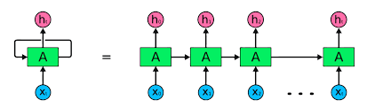
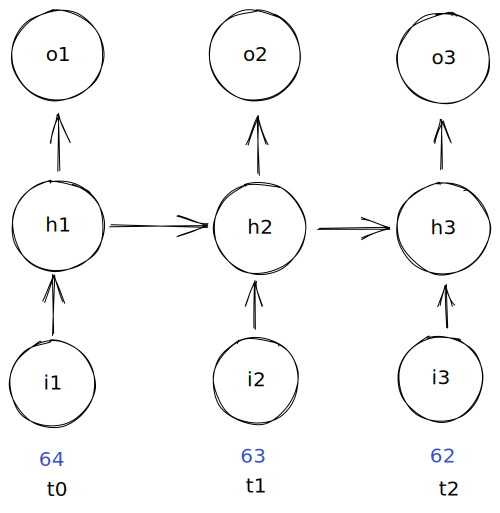
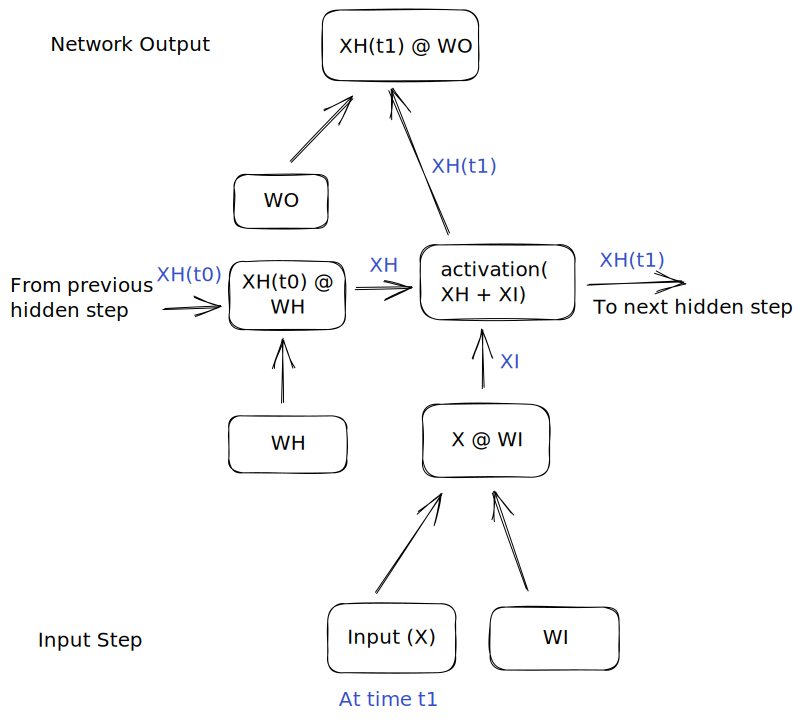

# 🔁 RNN-from-scratch 

Let’s explore the concept of Recurrent Neural Networks (RNNs) with an analogy that might be familiar if you've ever watched the weather forecast. Suppose you want to predict the weather for tomorrow. It's intuitive to consider today's weather and the weather from previous days because they are related; yesterday's weather influences today's, which in turn, affects tomorrow's. This sequential nature of data is where RNNs excel.

Imagine RNNs as students who tries to foreshadow from a fiction novel. A diligent student reads each chapter in order, building an understanding of the plot, characters, and setting as they go. Each new chapter is interpreted based on the preceding ones, accumulating knowledge that influences their expectations and predictions about the story's progression and outcomes. Similar to RNNs, a memory of the storyline helps with making an educated prediction on what the story is going to look like. 

On the other hand, using a standard dense network (a typical type of neural network without memory) would be like trying to predict tomorrow’s weather based only on today's data without considering the days before. A dense network sees each input (e.g., today's temperature, humidity, etc.) in isolation. It lacks the capability to remember past information and, therefore, would inefficiently try to learn the sequential dependencies anew each time.

So, in RNNs, the information flows through loops, allowing the network to pass information from one step of the sequence to the next. This loop acts like a memory storage that helps the network understand the entire context of the sequence, not just the individual elements. Hence, RNNs are particularly useful for tasks where the relationship between sequentially ordered data points is crucial, such as language translation, speech recognition, and, of course, weather forecasting.

## 🧠 High-Level Overview 

input, hidden(recurrent step/recurrence), output layer. 
Magic happens in hidden layer, as shown the arrow depicts the recurrent nature of this architechture. 

Hidden step is conneted to future hidden steps for sequencial elements. The hidden step passes the value in two directions such that it passes to the output layer and the next sequence element. Each hidden step has knowledgeo of previous hidden step values because it is being passed forward sequentially. 

At a really high level, the RNN can "feed each sequence elelnbt both to the output and forward to the next sequence element so that network builds a memeory of the sequence. 

In a Recurrent Neural Network (RNN), there are three main types of layers: the input layer, the hidden layer (also known as the recurrent step), and the output layer.

The hidden layer is where the core processing happens. It is depicted as having recurrent connections, meaning that the output of the hidden layer at one step becomes part of the input for the hidden layer at the next step. This architecture is shown clearly in diagrams by arrows point forward to the next sequence, indicating the flow of information from one time step to the next.

This recurrence allows each hidden step to be connected to future steps for sequences of elements. At the same time the hidden step also sends its results to the output layer.

The key characteristic of RNNs is their ability to "remember" parts of the input sequence in the hidden layer's state, which is passed sequentially from one step to the next. This memory is what allows the RNN to process different parts of a sequence in a contextually informed way.

At a very high level, we can think of an RNN as feeding each element of the sequence into both the output layer and forward into the next sequence element. This dual path allows the network to build a memory of the sequence, which informs outputs that are sensitive to the order and context of input elements. This memory feature is crucial for tasks where sequence order is key, such as language processing or time series prediction.

## ➡️ Feeding Forward

### Let's break down the image above. 

1. **Introducing the Input:**
   - Imagine we start with a temperature value, for instance, 64 degrees Fahrenheit. This temperature is our initial data point (input).

2. **Multiplication by Input Weight:**
   - This input value (64) is multiplied by the network's input weight (denoted as \( W_i \)). 
   - The result of this operation is represented as \( XI \) (where \( X \) is the input value and \( I \) represents the input weight). This multiplication adjusts the input data’s impact on the network.

3. **Processing in the Hidden Layer:**
   - The product \( XI \) is sent to the hidden layer.
   - Here, \( XI \) is added to the product of the previous output from the hidden layer and its corresponding weight (\( H_{prev} \times W_h \)), where \( H_{prev} \) is the hidden layer's output from the previous step, and \( W_h \) is the weight associated with the hidden layer.
   - The new input for the hidden layer becomes \( XI + (H_{prev} \times W_h) \).

4. **Applying the Activation Function:**
   - We apply a non-linear activation function (such as sigmoid or tanh) to the sum obtained in the hidden layer. This function helps the network learn complex patterns by introducing non-linearity.
   - The output after the activation function is \( XH \), which will serve as \( H_{prev} \) for the subsequent time step.

5. **Output Layer Dynamics:**
   - The \( XH \) value, now representing the current time step's output, is forwarded to the output layer.
   - It is then multiplied by the output layer's weight (\( W_o \)), and this final product forms the network’s output at this time step.

### 🔑 Key Concepts

1. **Sets of Weights:**
   - **Input Weights (\( W_i \))**: Scale the input data.
   - **Hidden Weights (\( W_h \))**: Used within the hidden layer to scale outputs from previous time steps.
   - **Output Weights (\( W_o \))**: Scale the output from the hidden layer to the final output.

2. **Parameter Sharing:**
   - A crucial feature of RNNs is the reuse of the same set of weights (\( W_i \), \( W_h \), and \( W_o \)) at each step of the sequence, known as parameter sharing. This approach reduces the total number of parameters the network needs to learn, making it efficient for learning from sequences where past information is key to understanding future states.

